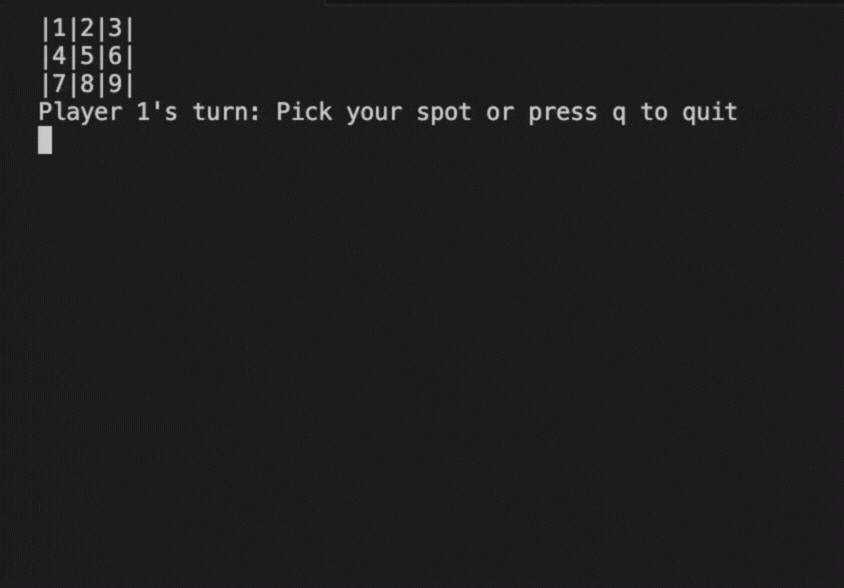

# TicTacToe Game

This is a command-line version of the classic Tic Tac Toe game, created using Python. Players alternate turns to place their mark. The game supports two players, displays the current board after each move, and checks for a winner or a tie. If a player tries to select an already occupied spot, the game prompts them to choose again. The game ends when there is a winner or the board is full.

## How It's Made:
Tech used: Python
This was built entirely from scratch using Python. I focused on writing clean, modular code by separating game logic into helper functions, handling user input carefully, and providing a smooth turn-based experience in the terminal. The project helped reinforce my understanding of control flow, dictionaries, and function-driven design.
